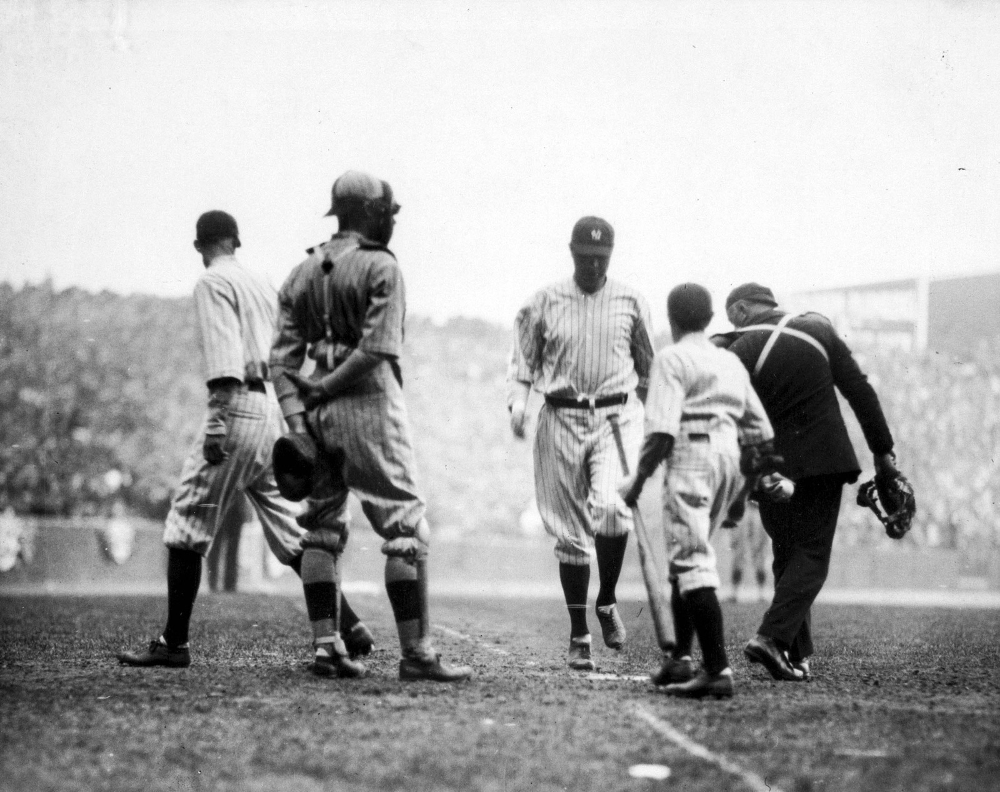

In 2017, Hurricane Maria knocked out three Baxter plants in Puerto Rico, and hospitals across the US suddenly couldn't get saline bags. Nurses went back to pushing drugs by syringe. In 2022, a COVID lockdown in Shanghai shut a single GE plant and hospitals started rationing contrast media — triaging which patients got CT scans. In 2024 it was blood culture bottles.

::: {.column-margin}
**The receipts.** Saline after Maria: Mazer-Amirshahi & Fox, ["Saline Shortages — Many Causes, No Simple Solution,"](https://www.nejm.org/doi/abs/10.1056/NEJMp1800347) *NEJM* 2018 — the Baxter plants supplied ~50% of US small-volume bags. Contrast media: the AHA's [May 2022 advisory](https://www.aha.org/advisory/2022-05-12-shortage-contrast-media-ct-imaging-affecting-hospitals-and-health-systems) on the GE/Shanghai shortage. Blood culture bottles: CDC [HAN-00512](https://www.cdc.gov/han/2024/han00512.html), July 2024.
:::

None of these products would top a spend report. A saline bag costs about a dollar. If you rank a hospital's supply chain by dollars — which is how essentially all procurement analytics works — the products that can actually stop care sit far down the list, invisible until the week they're unavailable.

I work on supply chain analytics for hospitals, and this is the prioritization problem we live inside: **materiality** (spend and volume) is measured to the penny, while **criticality** (what happens to patients if this product vanishes) is tracked in adjectives. When the two argue, the one denominated in dollars wins every time — not because it matters more, but because it has units.

This post describes a metric we designed to fix that: **HAR — Hours Above Replacement**. It puts savings opportunity and supply risk into one currency, so prioritization becomes a gradient you can walk instead of a meeting you have to hold. Full disclosure up front: this is a framework we've committed to paper and are now beginning to compute. I'm writing it up because I think the design is interesting independent of our implementation, and because writing it down publicly is a good way to have it shot at.

## The move borrowed from baseball

Sports analytics solved a version of this problem twenty years ago. Baseball's WAR — Wins Above Replacement — collapses hitting, fielding, and baserunning into a single number by asking one disciplined question: *how many wins does this player add compared to a freely available replacement* — the player you could call up from Triple-A tomorrow for the league minimum?

::: {.column-margin}
**Aside — the lineage.** [Bill James](https://en.wikipedia.org/wiki/Bill_James) coined [*sabermetrics*](https://en.wikipedia.org/wiki/Sabermetrics) and started publishing his samizdat *Baseball Abstracts* in 1977. The replacement-level idea was later formalized by Keith Woolner's [VORP](https://en.wikipedia.org/wiki/Value_over_replacement_player) (Value Over Replacement Player) at Baseball Prospectus, and ["wins above replacement"](https://en.wikipedia.org/wiki/Wins_above_replacement) is now the lingua franca of every front office.
:::

The baseline is the entire trick. Measuring against **zero** inflates everything (every starter looks priceless). Measuring against **average** punishes solid contributors unfairly. Measuring against **replacement level** asks the decision-relevant counterfactual: what do I lose if this specific thing disappears and the slot gets filled from the open market?

Products in a supply chain have exactly this structure:

- The **savings** question: you're paying $14 for a device your peers get for $9. The replacement for your *price* is the price a competent buyer gets without special leverage. Value lost = the gap.
- The **risk** question: what happens if the product itself becomes unavailable and the slot must be filled from whatever the market has left?

And here's the observation that makes the risk side tractable: **replacement level moves.** A saline bag has a deep substitute pool in normal times — its value above replacement is essentially zero, which is *why it's cheap*. When the pool collapses (a hurricane, a lockdown, a recall), the same product's value above replacement explodes without the product changing at all. **Criticality is not a property of a product; it's exposure to replacement-level collapse.** The risk term isn't a second metric bolted on — it's the same value-over-replacement quantity, evaluated under a stressed market state.



## The unit: hours of life

WAR works because wins are the currency of baseball. What's the currency of a hospital supply chain? Not dollars — dollars are the *input*. The output is patient health.

Health economics has a standard unit for this: the **QALY**, a quality-adjusted life year — one year in full health. It's the unit bodies like ICER and NICE use to evaluate whether drugs are worth their price, and the mainstream US benchmark values one QALY at around $100,000. A year has 8,766 hours, so:

::: {.column-margin}
**Aside — where the QALY comes from.** The [QALY](https://en.wikipedia.org/wiki/Quality-adjusted_life_year) was pulled into mainstream medical decision-making by [Milton Weinstein](https://en.wikipedia.org/wiki/Milton_Weinstein) and William Stason's 1977 *New England Journal of Medicine* paper, "Foundations of cost-effectiveness analysis for health and medical practices" — still the citation that launched a thousand cost-per-QALY tables.
:::

$$
\frac{\$100{,}000 \text{ per QALY}}{8{,}766 \text{ hours per year}} \;\approx\; \$11.40 \text{ per quality-adjusted hour}
$$

That exchange rate — call it *v* — is what lets dollars and clinical risk share a scale. An hour of quality-adjusted life is worth about eleven dollars and change, and now a $2M savings opportunity and a supply-disruption scenario can be compared as quantities instead of as a spreadsheet arguing with an anecdote.

You should immediately distrust this, so let me name the two honest problems with it.

**First, the number isn't settled.** There are two different justifications for a dollars↔health exchange rate, and they disagree by 3–5×. The *supply-side* story (Claxton and colleagues, the logic behind the UK NHS threshold of roughly £13k/QALY) says: dollars a health system saves get reinvested and *produce* health at the system's marginal rate. The *demand-side* story (ICER's $100k–150k/QALY, value-of-statistical-life estimates that work out to roughly $50/hour) says: this is what society is *willing to pay* for health. For procurement savings, the supply-side story is the causally correct one — money a hospital doesn't spend on devices is money it can spend on care.

::: {.column-margin}
**Aside — Claxton and ICER.** [Karl Claxton](https://en.wikipedia.org/wiki/Karl_Claxton) is a health economist at the University of York; Claxton et al. 2015 (*Health Technology Assessment*) empirically estimated the NHS's marginal productivity at ~£13,000 per QALY — the "supply-side" threshold. [ICER](https://en.wikipedia.org/wiki/Institute_for_Clinical_and_Economic_Review), the Institute for Clinical and Economic Review, is the closest thing the US has to [NICE](https://en.wikipedia.org/wiki/National_Institute_for_Health_and_Care_Excellence): an independent body whose $100k–150k/QALY benchmarks anchor American drug-price debates.
:::

**Second, and more subtly, the two sides of the metric don't cross the exchange rate symmetrically.** The risk term is *born in hours* — patient hours are directly what's at stake in a shortage; no valuation step happens at all. The savings term is born in dollars and only becomes hours *through* v. So v is really a **weighting knob between the two channels, not a shared unit conversion**, and the sum is strictly coherent only under the supply-side reading. The framework survives this as long as it's said out loud: we headline at $100k/QALY, carry a sensitivity band from $50k to $150k, and report how conclusions move across the band.

One phrasing rule we treat as mandatory: externally, dollar figures are "*valued at* the standard cost-effectiveness threshold." Never "lives saved." The first is defensible health economics; the second is a marketing claim the metric can't survive.

## The definition

$$
\mathrm{HAR}(p) = \mathrm{HAR}_{\mathrm{savings}}(p) + \mathrm{HAR}_{\mathrm{risk}}(p)
\qquad \text{[quality-adjusted hours per year]}
$$

$$
\mathrm{risk\_share}(p) = \frac{\mathrm{HAR}_{\mathrm{risk}}}{\mathrm{HAR}}
\qquad \text{[always carried alongside]}
$$

If WAR is the analogy, HAR_savings is the batting statistic — well-measured, high-resolution, computed from millions of observed transactions. HAR_risk is the fielding statistic — noisier, coarser, and the reason the composite exists at all. Baseball fans will remember the "WAR wars": arguments where decimal-point precision in batting lent false credibility to much fuzzier fielding estimates. We'll come back to that failure mode, because it's the one this metric has to actively defend against.

::: {.column-margin}
**Aside — the WAR wars.** The canonical episode is the 2012 AL MVP race: [Miguel Cabrera](https://en.wikipedia.org/wiki/Miguel_Cabrera) won the Triple Crown; [Mike Trout](https://en.wikipedia.org/wiki/Mike_Trout) posted ~10 [WAR](https://en.wikipedia.org/wiki/Wins_above_replacement), much of it from defense and baserunning — the fuzzy components. The argument was never really about the players; it was about how much precision the fielding numbers deserved.
:::

### The savings channel

$$
\mathrm{HAR}_{\mathrm{savings}}(p) =
\frac{\displaystyle\sum_{\text{facilities } f}
\max\!\big(0,\ \mathrm{price}_f - \mathrm{price}_{\mathrm{repl}}(\mathrm{cohort}_f)\big)
\times \mathrm{qty}_f \times \mathrm{achievability}}
{v \ \ (\approx \$11.40/\text{hour})}
$$

This is the familiar benchmark-savings calculation — what a facility pays above a reference price, times volume — re-denominated in hours. It's deliberately backward compatible: zero out the risk term and HAR collapses to a sharpened version of the spend-materiality analysis procurement teams already run. But three definitional choices carry the sharpening, and each one exists because the naive version produces numbers that negotiations can't deliver:

**1. Replacement price is the cohort *median*, not the best price.** Benchmarking every hospital against the single best price in the dataset is measuring against the All-Star, not the waiver wire. Replacement level is what a competent buyer gets *without special leverage* — the median. The best-quartile number can ride along as a labeled stretch goal, but the headline is the median, because the headline should be deliverable.

::: {.column-margin}

Babe Ruth, 1920. The savings channel is the batting statistic: high-resolution, obsessively measured, and where all the headlines come from. *(Photo: Irwin, La Broad & Pudlin. Public domain, via Wikimedia Commons.)*
:::

**2. Replacement level is conditional on who you are.** Contract tiers explain a large share of price variance for high-end devices; a 25-bed rural hospital cannot get the mega-health-system price, and pretending it can doesn't create recoverable hours — it creates a fake number. So the replacement price is computed within cohort: class of trade, size, and — critically for pharmacy — account type, because US drug pricing programs like 340B create legitimate multi-tier pricing that looks like dispersion if you ignore it. Unit-of-measure normalization is mandatory for the same reason: an each-versus-case slip creates a phantom 12× "opportunity" that will happily sit at the top of your queue burning analyst time.

**3. An achievability haircut.** Not every dollar of measured excess is capturable — switching friction, physician preference, bundled contracts. The haircut can be crude (one number per category family, estimated from your own history of identified-versus-realized savings), but it must exist, or HAR_savings is an upper bound and should be labeled as one.

None of these is exotic. Each is just the replacement-level discipline applied to a place where the naive calculation flatters itself.

**A worked example.** A mid-size hospital implants 300 primary knees a year at $5,000 per implant construct. The cohort median — what hospitals its size pay without special leverage — is $4,200. The excess is $800 × 300 = $240,000 a year. Its own capture history says about half of identified implant savings survive negotiation (achievability 0.5), so $120,000. Divide by v:

$$
\frac{\$800 \times 300 \times 0.5}{\$11.40/\text{hour}} \;\approx\; 10{,}500 \text{ hours/year} \;\sim\; 10^4
$$

One product line, one hospital, and the number is already more than a full year of healthy life annually — *valued at* the standard threshold, remember, not produced. This is the well-measured channel: every input except the achievability haircut comes straight out of transaction data.

### The risk channel

::: {.column-margin}

Boston's "Golden Outfield" — Duffy Lewis, Tris Speaker, and Harry Hooper, c. 1912. Everyone agreed the fielding was extraordinary; nobody could say by how much. Fielding is the noisy channel, in baseball and in supply chains. *(Public domain, via Wikimedia Commons.)*
:::

$$
\mathrm{HAR}_{\mathrm{risk}}(p) =
P(\text{replacement-pool shrink})
\times \text{downstream hours at stake}
\times P(\text{no viable path around } p)
$$

Three terms, in descending order of measurability:

**Volume** is exact — transaction data tells you precisely how many uses of a product occur per year.

**P(disruption)** is estimable at order-of-magnitude resolution from public data: the FDA's [device shortage list](https://www.fda.gov/medical-devices/medical-device-supply-chain-and-shortages/medical-device-shortages-list) (a CARES Act disclosure requirement) and [openFDA](https://open.fda.gov/apis/device/enforcement/) recall feeds give base rates per product family.

**Downstream hours at stake** is the hard one, and log-resolution is the honest resolution. The question that matters is "is this a 10-hour product or a 10,000-hour product?" — and order-of-magnitude separation carries almost all of the prioritization value. Device classification systems (FDA device class, GMDN categories) tell you whether something is implantable or life-sustaining; published QALY estimates exist for major procedure families (joint replacement, cardiac devices, stents, dialysis). That's enough to place products in the right decade, and the right decade is enough.

So HAR_risk gets published as a range — 10³–10⁵ hours/year — and differences smaller than the error bars are noise by declaration. This is the anti-"WAR wars" guardrail: never let the four-significant-figure precision of the savings channel lend its credibility to the risk channel. They share a unit, not an error bar.

Two structural warnings that took real review to surface:

**Don't multiply the probabilities as if they're independent.** P(disruption) and P(no substitute) are positively correlated — single-source products have the most fragile supply chains, and disruptions are exactly what shrink substitute pools. Independence understates tail risk for precisely the scariest products. Where a family is single-source, estimate the joint probability directly (shortage base rates *conditional on* single-source status); where you can't, cap the joint term at the smaller of the two instead of taking their product.

**A worked example.** Same hospital, iodinated contrast media — the product behind the 2022 rationing. The hospital runs about 20,000 contrast-enhanced scans a year. Working the three terms in log bins: a 2022-scale disruption for this product family has a base rate around 10⁻² per year; given an event, triage protocols defer roughly a quarter of scans for two months (~800 deferred studies), at an expected late-or-missed-diagnosis harm of 10–100 quality-adjusted hours per deferred study — the genuinely fuzzy term; and with two major suppliers, the no-viable-path probability is near 0.5. Multiplying through:

$$
10^{-2} \times \big(800 \times 10\text{–}100\ \text{h}\big) \times 0.5
\;\approx\; 10^2\text{–}10^3 \text{ expected hours/year}
$$

Now look at what the number *does*. As an annualized expectation it sits below the knee-implant savings figure — a naive reading says contrast media matters less than knee prices. But the year the event actually lands, the realized loss at this hospital is $10^4$–$10^5$ hours — and it lands at every hospital simultaneously, because a supply shock is a correlated event, not an idiosyncratic one. Risk that doesn't diversify across facilities is exactly the kind a system-level ranking has to carry even when each facility's expectation looks small. Keep that in mind for the leaderboard below.

**Criticality is a network property, and it doesn't sum.** A contrast agent's hours-at-stake aren't its own — they're inherited from every imaging-guided procedure downstream of it. Complement edges (consumed-by, required-for) propagate risk upstream; substitute edges shunt it away. And because a procedure needing five inputs assigns each input the *full* procedure-hours conditional on being the binding failure, you cannot total the HAR_risk column into a portfolio number. "What breaks if *this* disappears" is the right per-product question; the column is not a partition of anything. Someone will try to sum it anyway. This paragraph exists for them.

## The graph you mostly don't build

That network framing implies a dependency graph — products, procedures, substitutes, edges everywhere. The reflex is to go build it. The discipline is to build an edge only where resolving it could change a decision, and to let spend bound the value of everything you skip: the hours at stake behind a choke point can't exceed what the volume flowing through it implies. One trap is nasty enough to name, and it's the motivating examples that fall into it: if your cheap proxy for "hours at stake" is regulatory device class, you will prune saline, contrast media, and blood culture bottles *before their edges are ever built* — low-class commodity products whose criticality is invisible until you know what they gate. So high-volume, low-class consumables get a carve-out: assume they gate procedures until one hop of evidence (kit bills-of-materials, co-purchase patterns) says otherwise.

## Reading the number: rank by the sum, act by the ratio

Procurement strategy has a classic 2×2, the Kraljic matrix: leverage items, strategic items, bottlenecks, routine buys. It's taught everywhere and quantified almost nowhere. HAR recovers it as a scalar and a ratio:

::: {.column-margin}
**Aside — Kraljic.** Peter Kraljic was a McKinsey director whose 1983 *Harvard Business Review* article, "Purchasing Must Become Supply Management," gave procurement its most durable framework: the [Kraljic matrix](https://en.wikipedia.org/wiki/Kraljic_matrix), classifying items by profit impact × supply risk. Forty years later it's still taught from the same 2×2 — usually filled in by workshop vote rather than by data.
:::

| risk_share | Posture |
|---|---|
| ≈ 0 (savings-dominated) | Leverage: negotiate hard, commoditize |
| ≈ 1 (risk-dominated) | Secure supply: dual-source, hold inventory, contract for continuity — and stop squeezing |
| both channels large | Strategic: the metric flags it; judgment settles it |

The sum orders the portfolio — and it's robust for ordering, because a mis-estimated 10³ never displaces a real 10⁶. The ratio picks the action. And it makes a sentence possible that procurement decks could never say before: *"this category's supply risk is worth ten times its savings opportunity, so we're buying continuity, not discounts."* That's a quantitative claim with an audit trail.

There's a pleasing self-diagnostic hiding in the sensitivity band, too. Remember that v moves only the savings channel. So a category whose posture *flips* somewhere across the $50k–$150k band is, by construction, a category where the two channels are comparable — which is exactly the definition of the strategic quadrant. What first looks like the metric's embarrassing instability is actually its detector for the cases that deserve human judgment. The arithmetic flags them; it doesn't settle them.

## The leaderboard: what tops HAR right now

So what does the ranking actually look like? Below is an illustrative national-scale leaderboard — ten product families, annual US figures, built **entirely from public anchors**: the FDA device and drug shortage lists, published QALY-per-procedure literature, and the public history of supply events. No proprietary transaction data — a real implementation computes this per health system from its own purchases, and the numbers land wherever they land. Everything is a log bin, per the risk channel's own honesty rule: trust the decades, not the digits.

| # | Product family | HAR~savings~ (h/yr) | HAR~risk~ (h/yr) | risk_share | Posture |
|--:|---|---:|---:|---:|---|
| 1 | Hip & knee implants | 10⁸ | 10⁴·⁵ | ≈ 0 | Negotiate |
| 2 | Stents & cardiac rhythm devices | 10⁷·⁵ | 10⁵·⁵ | 0.01 | Negotiate |
| 3 | IV saline & solutions | 10⁵·⁹ | 10⁷·³ | 0.96 | Secure supply |
| 4 | Iodinated contrast media | 10⁶·¹ | 10⁷·¹ | 0.91 | Secure supply |
| 5 | Platinum chemotherapies | 10⁴·⁵ | 10⁷ | ≈ 1 | Secure supply |
| 6 | Exam & surgical gloves | 10⁶·⁸ | 10⁵·² | 0.02 | Negotiate |
| 7 | Blood culture bottles | 10⁵ | 10⁶·⁸ | 0.98 | Secure supply |
| 8 | Dialysis consumables | 10⁶·³ | 10⁶·⁵ | 0.61 | **Strategic** |
| 9 | Infusion pumps & sets | 10⁶·⁵ | 10⁶·² | 0.33 | **Strategic** |
| 10 | Heparin | 10⁵·⁵ | 10⁶·⁵ | 0.91 | Secure supply |

: Illustrative, order-of-magnitude, US national scale. Sorted by total HAR. {tbl-colwidths="[4,30,18,17,13,18]"}

Read the ranking against the spend report it replaces. A spend-only ordering keeps rows 1, 2, and 6 and buries the rest — saline, platinum chemo, and blood culture bottles live in the bottom half of any dollar ranking, when they appear at all. Here they sit at #3, #5, and #7, carried entirely by the risk channel. That interleaving *is* the metric's contribution: rows the spend report agrees with, rows it can't see, on one scale. (It's also, not coincidentally, the gate question from the roadmap answered in the affirmative for the illustrative case — the risk term moves ranks. Whether it moves ranks *in our measured data* is what the real computation has to establish.)



*The same ten families, re-ranked. Left: spend order, what procurement already sees. Right: total-HAR order. Risk carries saline, platinum chemo, and blood-culture bottles up out of the basement; the big-ticket devices that dominate spend slide down. Every crossing line is a product a dollar ranking mis-prioritizes.*

And "right now" is doing real work in the section title: the risk channel updates with the shortage lists. Blood culture bottles were on nobody's 2023 map; the 2024 disruption put them on this one. A HAR leaderboard is a current-events document with a denominator — which is precisely what a criticality metric should be, and what a static Kraljic workshop poster is not.

::: {.column-margin}
**Aside — HAR points inward, too.** We rank more than product families this way. Data-quality review queues are prioritized by the HAR at stake behind each suspected error — one unit-of-measure slip on a high-HAR line outranks a hundred cosmetic defects — and the training data for our in-house classification and embedding engine (a custom fastText/floret model) is balanced the same way, so it sees the most examples from the categories where a misclassification costs the most hours.
:::

### The HAR map

The same ten families as a picture — this is the action map from the previous section made literal. Savings-hours across, risk-hours up, both log-scaled; the diagonal bands are risk_share, so **height above the dashed line is lopsidedness toward risk**, and the band a product lands in is its posture. Hover for each family's numbers.



*The HAR map. Illustrative log-bin estimates from public anchors; axes in quality-adjusted hours per year. The negotiate band (lower right) is where procurement already lives; the secure-supply band (upper left) is what a spend ranking can't see; and the strategic band between them is where the sensitivity-band flip detector earns its keep. Regenerate with `posts/_har_map_gen.py`.*

## The gate

Everything above is design. Here's the discipline that governs whether it gets built.

The expensive parts of HAR are all in the risk channel — shortage base rates, hours anchors, the dependency graph. The cheap part, HAR_savings plus a crude three-tier risk column on the top 25 categories, is a few hours of work on data we already have. So the first computation is a falsification test: **does the risk term ever move a rank?** If HAR's ordering merely reproduces the spend ordering at category grain, the risk channel adds no signal at that grain, and every downstream investment — graph, edges, base rates — is unjustified. Stop, keep the sharpened savings metric (it improves the existing deliverable on its own), and retest at finer grain before spending more.

Two subtleties even in the cheap version: the risk tiers must be assigned by asking *what does this product gate downstream* — not by device class, or saline gets tiered low and the gate is rigged against the motivating examples. And the simple sum HAR = savings + risk quietly assumes disruption is a rare event; for a category *already* in active shortage that assumption fails, and you have to weight the two market states by their actual probabilities — or the arithmetic is invalid exactly where risk matters most.

Running the falsification test before the build isn't caution; it's the same expected-value-of-information logic the metric applies to everything else, applied to itself.

## What happens when everyone plays Moneyball?

A fair question to ask of any metric: what breaks if the whole industry adopts it? Baseball already ran this experiment. When only Oakland used analytics, the inefficiency was an edge; twenty years later every front office has a quant department and the edge is gone — the market *learned the metric*. Something analogous happens to HAR at industry scale, and it's worth walking through, because the failure modes are specific — and one of the outcomes is genuinely good.

::: {.column-margin}
**Aside — Moneyball.** Michael Lewis's [*Moneyball*](https://en.wikipedia.org/wiki/Moneyball:_The_Art_of_Winning_an_Unfair_Game) (2003): the 2002 A's exploit the market's mispricing of on-base percentage. Within a decade OBP was priced correctly league-wide and the edge was gone.
:::

The unifying observation is that HAR, like most analytics, is designed from the point of view of a **price-taker** — one buyer measuring a market it doesn't move. Adopted industry-wide, buyers become **price-makers**, and the data the metric was calibrated on describes a world that no longer exists. Economists call this the Lucas critique, and it lands on each channel differently.

**The savings channel eats itself — gracefully.** HAR_savings is measured against the cohort median. If everyone negotiates toward the median, the median falls, dispersion collapses, and HAR_savings → 0 across the industry. That's not chaos; it's the metric retiring its own savings channel once prices are efficient — the Moneyball ending. Every queue then becomes risk-dominated, which is arguably the correct end state: attention migrates from price transfers (zero-sum between buyer and supplier) to resilience (positive-sum).

::: {.column-margin}
**Aside — the Lucas critique.** [Robert Lucas](https://en.wikipedia.org/wiki/Robert_Lucas_Jr.), "Econometric Policy Evaluation: A Critique" (1976): models calibrated on historical behavior break when policy changes the incentives that generated the history — the [Lucas critique](https://en.wikipedia.org/wiki/Lucas_critique). It applies to every metric that becomes a policy.
:::

**Margin compression feeds the fragility the other channel measures.** This is the serious one. Universally squeezing leverage-quadrant items toward replacement price is *the mechanism that created the fragile markets in this post's opening paragraphs*. Saline was a dollar because everyone squeezed; thin-margin manufacturers underinvested and exited; the pool concentrated; a hurricane finished the job. HAR contains its own correction — risk_share ≈ 1 says *stop squeezing* — but the risk channel runs on lagging inputs (shortage lists record past disruptions; concentration indices describe current structure). The compression happens now; the warning arrives after the marginal supplier has already left. At scale, the metric prices fragility after it exists, not while it's being manufactured.

**Shared inputs correlate everyone's behavior — the panic and the blind spots alike.** If every buyer reads the same public shortage data and follows the same secure-supply posture, then when disruption probability spikes, everyone stockpiles simultaneously — a bank run with a dashboard, the bullwhip effect with better software. And the same monoculture governs what everyone *ignores*: shared pruning rules on shared data sources mean the whole industry declines to look at the same regions, so the next saline-class surprise hits everyone at once — finance learned exactly this with Value-at-Risk. The fixes have to live in the metric: fund capacity *before* the flood rather than hoard inventory during it (adding supply is stabilizing; hoarding is zero-sum in a crisis), and keep idiosyncratic, private inputs in the model — diversity of prioritization schemes is itself a hedge.

::: {.column-margin}
**Aside — the [bullwhip effect](https://en.wikipedia.org/wiki/Bullwhip_effect).** Named inside Procter & Gamble and formalized by Hau Lee, Padmanabhan, and Whang in "The Bullwhip Effect in Supply Chains" (*Sloan Management Review*, 1997): small demand fluctuations amplify as they propagate up a supply chain, because every tier over-orders in self-defense. Correlated stockpiling is the same physics with better software.
:::

**Vendors will Goodhart it — and the metric publishes the payoff.** Suppliers already game benchmarks (bundles, unit-of-measure games, cohort-fragmenting contract terms); that just intensifies. The novel exposure is on the risk side: HAR tells vendors, in writing, that a product with risk_share ≈ 1 stops getting squeezed and starts earning continuity premiums. A vendor who engineers away substitutability — proprietary consumables, closed systems, kit lock-in — moves themselves into the quadrant where the buyer's own framework says to pay them more. And a published utility function is a negotiating gift: if every buyer values hours at $100k/QALY, suppliers of risk-dominated products can price toward the health value rather than cost-plus. Being legible cuts both ways.

::: {.column-margin}
**Aside — [Goodhart's law](https://en.wikipedia.org/wiki/Goodhart%27s_law).** [Charles Goodhart](https://en.wikipedia.org/wiki/Charles_Goodhart), then at the Bank of England, observed in 1975 that any statistical regularity collapses once used for control. The version everyone quotes — "when a measure becomes a target, it ceases to be a good measure" — is actually anthropologist [Marilyn Strathern](https://en.wikipedia.org/wiki/Marilyn_Strathern)'s 1997 paraphrase. Both careers' worth of evidence applies here.
:::

**And one quiet ethical externality.** QALY-weighted hours inherit the standard QALY criticisms: interventions for elderly, disabled, or palliative populations mechanically produce fewer quality-adjusted hours. One buyer using that as an attention heuristic is a judgment call. An industry using it is an allocation policy nobody voted on — the same categories fall below the attention line *everywhere*. If HAR spreads, that deserves a deliberate answer, not an inherited default.

Against all of that, the stabilizing case — and I think it wins on net. Today, criticality is unpriced, so the market systematically underinvests in it: nobody pays extra for the reliable saline plant, so nobody builds one. A world where every hospital's framework says "pay continuity premiums on risk-dominated categories" is a world with a revenue stream for redundant capacity — which is the fix shortage-policy people have been asking for for a decade, arrived at through procurement math instead of regulation. Universal adoption doesn't cause chaos so much as it *forces the metric to grow up*: base rates treated as endogenous, an anti-run rule in the secure-supply posture, capacity-funding preferred over hoarding, and some deliberate diversity in what everyone declines to look at.

## What I'd tell you to steal

If you run analytics anywhere that "strategic importance" keeps losing arguments to "measured dollars," the transferable moves are:

1. **Denominate everything in the outcome unit**, even coarsely. A shared unit turns meetings into arithmetic — and the places where the arithmetic is genuinely unstable turn out to be the places that deserved a meeting.
2. **Measure against replacement, not zero.** The decision-relevant counterfactual is "this vanishes and the market fills the slot."
3. **Let the two channels keep different error bars.** Shared unit ≠ shared precision. Publish ranges for the fuzzy channel; ban decimal arguments there.
4. **Falsify cheap before building expensive.** The first computation should be the one that can tell you to stop.
5. **Ask what breaks when everyone adopts it.** A metric good enough to spread will eventually be the market it was calibrated on. Design for the price-maker case before you're in it.

There's a reason the *Moneyball* scene everyone quotes is the one in the scouting room. The scouts go around the table explaining why nobody should want the players Billy Beane wants — the swing is ugly, the body's wrong, he can't throw. Every objection is true. Every objection is also priced in the wrong currency, and Beane keeps answering with the only sentence in the room denominated in runs: *he gets on base.*

The saline bag is still a dollar. It has an ugly swing, a thin margin, and a spot near the bottom of every spend report ever printed. It gets on base.



---

I wrote this up to have it shot at. If you work in procurement, health economics, or hospital supply chain and you think the design leaks somewhere — most of all if you think the risk term *won't* move ranks once it meets real purchasing data — that's the falsification test we're running next, and I'd rather hear where it's wrong now. Reach me at [jjd@jjd.io](mailto:jjd@jjd.io) or [@omgjjd](https://x.com/omgjjd).

*HAR is joint design work with my colleagues at Curvo, where we build supply chain analytics for hospitals. All dollar-to-health conversions in this post are valuations at the standard cost-effectiveness threshold, with stated sensitivity — not claims about health produced.*
