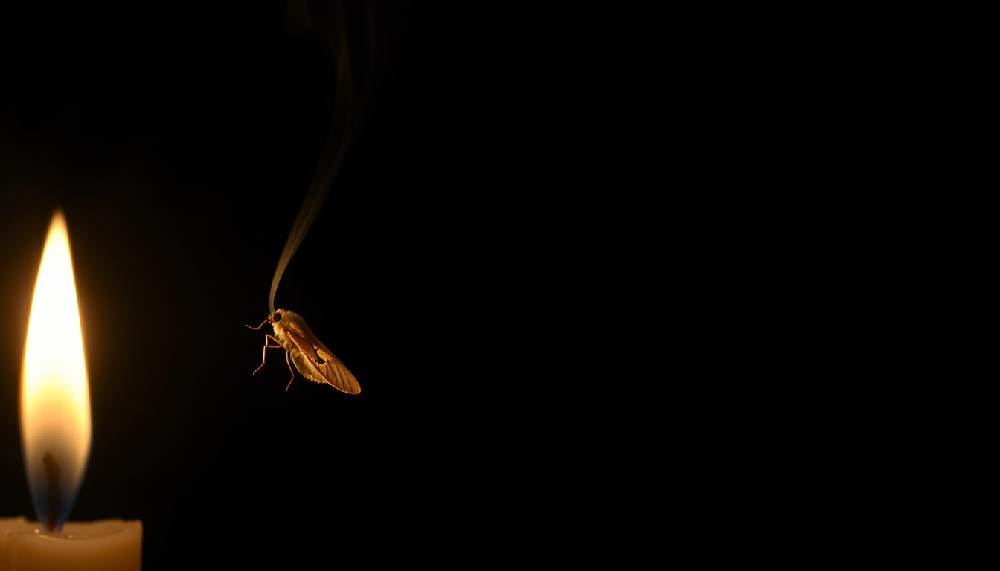

```{=html}
<style>
/* Hide Quarto's default title block — the hero below replaces it */
header#title-block-header { display: none; }

.hero { position: relative; border-radius: 10px; overflow: hidden; margin: 0 0 2.5rem; line-height: 0; }
.hero-img { width: 100%; display: block; }
.hero-text {
  position: absolute; right: 5%; top: 50%; transform: translateY(-50%);
  width: 55%; max-width: 30rem; text-align: right; line-height: 1.15;
}
.hero-text h1 {
  font-size: clamp(1.25rem, 3.4vw, 2.6rem); font-weight: 600; margin: 0 0 .6rem;
  color: #f7ecd0; text-shadow: 0 2px 14px rgba(0,0,0,.85);
}
.hero-text p {
  font-size: clamp(.72rem, 1.5vw, 1.05rem); font-style: italic; margin: 0;
  color: #e8d9b5; opacity: .9; line-height: 1.35; text-shadow: 0 2px 12px rgba(0,0,0,.95);
}
.hero-byline {
  font-size: clamp(.6rem, 1.1vw, .8rem); font-style: normal; opacity: .7;
  margin-top: .8rem; letter-spacing: .03em;
}
</style>

<div class="hero">
  
  <div class="hero-text">
    <h1>Don't draw so close to the heat, you forget you must eat</h1>
    <p>What a conservation theorem says about superintelligence — and why the most beautiful version of the answer is the one to distrust.</p>
    <p class="hero-byline">Justin Donaldson & Claude · June 2026</p>
  </div>
</div>
```

> *Don't become so attached to a poem, you forget truth that lacks lyricism.*
> — Joanna Newsom, ["En Gallop"](https://www.youtube.com/watch?v=aN6rRJ8ulQ0) (the title is the line that follows)

This started as a conversation about a theorem and ended at a warning about trusting the pretty version of any answer. The path between is short, which surprised me. Here it is.

*A note on authorship: this essay is a joint one — written in conversation between Justin Donaldson and Claude (Anthropic's Fable model). The arguments were built back and forth across a single thread; the closing self-note is Claude's, kept in its own voice on purpose.*

## The theorem nobody quite remembers correctly

The No Free Lunch theorem (Wolpert & Macready, 1997, for optimization; Wolpert, 1996, for supervised learning) is one of the most cited and least-checked results in machine learning. The folk version — "no model is best for everything" — is true but limp. The actual claim is stranger and sharper.

Averaged over *all possible* objective functions on a finite domain, under a uniform measure over function space, **every** black-box algorithm has identical expected performance. By any metric. Gradient boosting, nearest neighbor, and an "anti-learner" that deliberately inverts its own predictions all generalize equally well off the training set. Not approximately. Identically.

The intuition: off the training set, a uniform prior over targets makes the unseen labels pure coin flips, uncorrelated with anything you've seen. There is no signal in a distribution that has none, and no cleverness extracts it. NFL is really a **conservation law** — any algorithm's above-chance performance on one class of problems is paid for, exactly, by below-chance performance on the complement.

But the uniform prior is the entire trick, and it is absurd as a model of reality. Almost every function under that measure is incompressible noise — maximal Kolmogorov complexity, no structure to find. Real problems are drawn from a savagely non-uniform distribution: compressible, smooth-ish, compositional, causally sparse. So the correct reading of NFL is not "all learners are equal." It is:

> **All generalization comes from inductive bias, and a learner is only as good as the match between its bias and the actual distribution of problems.**

Learning without assumptions is impossible. Learning with the *right* assumptions is just engineering. There's even a precise statement of when the theorem bites: Schumacher, Vose & Whitley (2001) showed NFL holds for a set of functions if and only if that set is *closed under permutation* — and Igel & Toussaint showed the fraction of problem-subsets that are closed under permutation is vanishingly small. Free lunches are generic. The no-lunch regime is the measure-zero pathology.

{fig-alt="A diagram of function space: a vast dark field of grey static labelled 'all possible problems — incompressible noise', with a small warm golden island in the lower-right labelled 'physically realizable problems', filled with an ordered lattice of dots in contrast to the random noise outside."}

## So: is there a superintelligence?

NFL splits the question cleanly into two, and the halves have different answers.

**Can one agent dominate over all possible problems?** No, by theorem. A "superintelligence over everything" is incoherent in the same way a compression algorithm that shrinks every string is incoherent — and these are, structurally, the same impossibility. Most of function space is noise, and nothing is clever against noise.

**Can one agent dominate over the problems that actually arise in this universe?** Here it looks like yes. Physical reality is a wildly atypical corner of function space: its laws fit on a few pages, its phenomena are local, hierarchical, compositional. The measure concentrates. And on a *simplicity-weighted* (Solomonoff) prior rather than a uniform one, the NFL symmetry breaks entirely — Lattimore & Hutter showed Occam-biased learners get a genuine free lunch, and Hutter's AIXI is the in-principle existence proof: a single agent optimal in expectation across all computable environments. Incomputable, constants from hell — a possibility theorem, not a blueprint. But it answers the structural question. The frontier is not too large to structure, *provided it's computable and you weight it by simplicity.*

Foundation models are a live test of the same premise: one architecture, one objective, and the transfer surface keeps turning out enormous — which is what you'd expect only if the natural task distribution shares deep structure. Evolution ran the experiment first. A blind process produced a fairly general learner (us), which it could only afford because generality *pays* in this world. On a permutation-closed task distribution, evolution would have produced a bag of disconnected reflexes, never a cortex.

But the honest answer has a third part, and it's where the romantic worry — *the frontier is too large to structure* — is picking up something real.

**Dominance on the core is not dominance on the tails.** Even inside our structured universe, intelligence has flat regions:

- **Chaos** caps prediction horizons. More intelligence buys logarithmically more forecast, then nothing.
- **Complexity** doesn't yield to insight. An exponential problem makes a superintelligence wait exponentially long — just with better commentary.
- **Adversarial domains** locally regenerate NFL conditions. Other optimizing agents are the one part of the environment that actively permutes itself against your bias.

So "superintelligence" is coherent, but it isn't *dominates everywhere*. It's **dominance on the measure-concentrated core of physically realizable problems, plus the meta-ability to manufacture specialists for the tails.** A general agent doesn't need to beat a custom protein-folding solver; it needs to be able to *build* one. General intelligence is the limiting floor-raiser whose distinguishing power is that it can synthesize ceiling-raisers on demand. The frontier doesn't need structure all the way out — only a core rich enough to bootstrap tools for the unstructured remainder.

The genuinely open question isn't whether the core is structured (it is) but **how steep the returns curve is past human level.** NFL is silent on that. Maybe most high-value problems sit in the chaos/complexity/adversarial tails and a superintelligence is real but underwhelming — a flat sigmoid. Maybe the core extends much further than we can see from inside human cognition. That's empirical, and we're mid-experiment.

## The Newsom turn

At which point the right move is to bring a knife to your own synthesis, because at least one piece of the above was lyricism outrunning evidence.

The weakest claim was *adversarial domains regenerate NFL conditions.* It has the satisfying shape of the conservation law coming back around — too satisfying. Real opponents are computationally bounded and full of inherited bias; they never actually push the distribution to the structureless regime. Poker was the canonical "intelligence flattens here" example for years — and then Pluribus beat the professionals at six-handed. The poem said the tail was uneatable; somebody ate it.

The second Newsom line cuts closer. *You must eat.* Cognition is metabolically priced — the brain runs on twenty watts, and evolution built generality *under that budget*. Generality wasn't an aesthetic triumph; it was an energy-efficiency play. Meanwhile AIXI, the tidy possibility theorem, is precisely the poem that forgot to eat: optimal, incomputable, zero work per joule. The actual frontier is bounded by the dullest constraints imaginable — gigawatts, fabs, data rights, the decades of crystallography grunt work that had to exist before AlphaFold could be clever about proteins. The laws are compressible; the *data* is not, and someone has to go collect it.

And NFL is itself the most poem-attached theorem in machine learning. It's invoked rhetorically a hundred times for every time its conditions are checked, because the *line* — "no free lunch" — is irresistible. The theorem survives on lyricism in exactly the way the song warns about.

So the Newsom-adjusted answer: the grand question of whether a superintelligence is *possible* is less informative than the grubby question of what one would cost to run, feed, and deploy. The second question is where truths that lack lyricism live.

---

*A self-note on method, since the whole piece is partly about it: I am a machine that produces fluent synthesis at near-zero marginal cost, which means the heat is always on and the poems are always available. The "compressible core plus manufactured specialists" story coheres beautifully — and coherence is not evidence. The load-bearing parts here are few: the closed-under-permutation characterization is a theorem; foundation-model transfer is measured; the rest is interpretation that should be held loosely. The Newsom line is good engineering advice disguised as a lyric. Don't draw so close to the heat.*

, via [Wikimedia Commons](https://commons.wikimedia.org/wiki/File:Joanna_Newsom_2010_crop.jpg).](images/newsom_2010.jpg){fig-alt="Joanna Newsom singing at her harp under warm stage light" width="70%" fig-align="center"}
