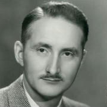
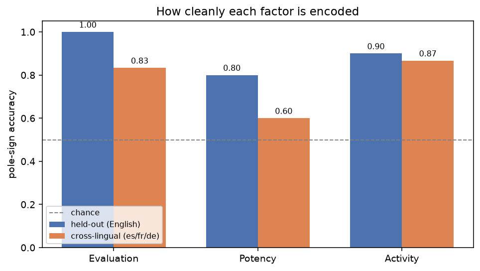
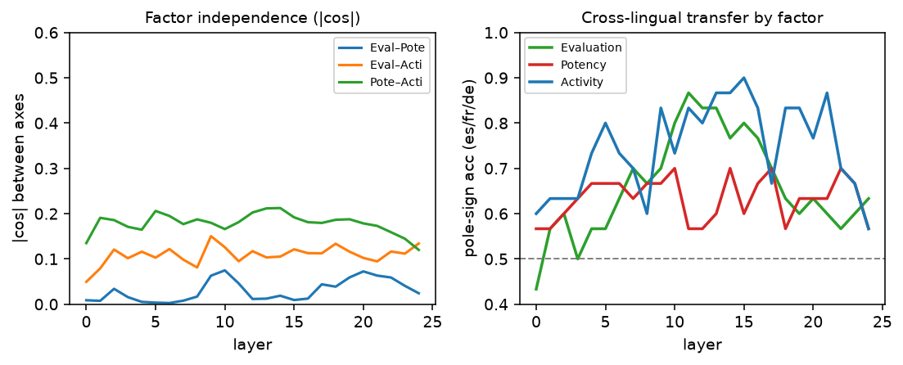
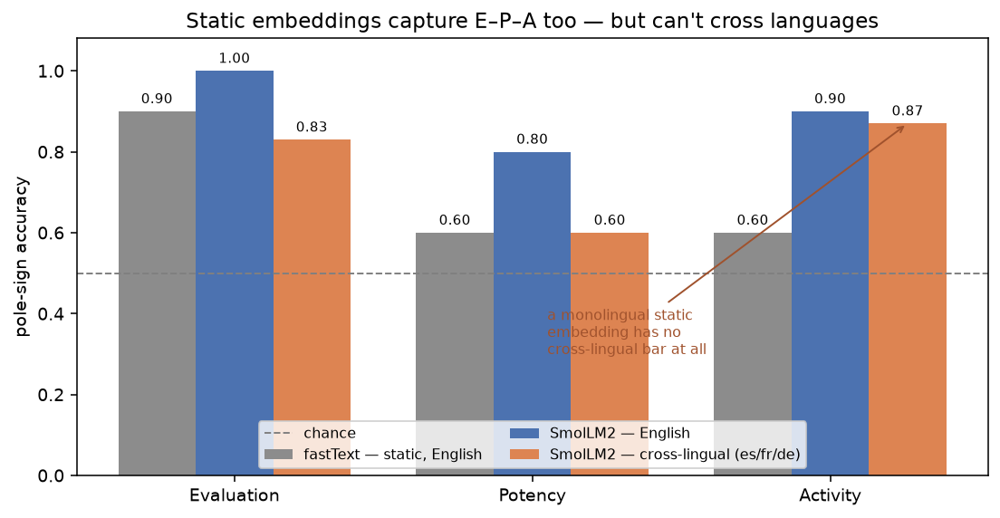

> Meaning, Osgood found, is mostly three numbers.
>
> — *paraphrasing* The Measurement of Meaning *(Osgood, Suci & Tannenbaum, 1957)*

::: {.column-margin}

:::

In 1957, the psychologist Charles Osgood handed people a word—*tornado*, *mother*, *nuclear*—and a stack of rating scales: *good–bad*, *strong–weak*, *fast–slow*, *hot–cold*, dozens of them. Then he did the factor analysis. Across twenty-some language communities and a parade of cultures, the same answer kept falling out: the connotative meaning of a word is mostly **three numbers**.

He called them **Evaluation** (good–bad), **Potency** (strong–weak), and **Activity** (active–passive). The *semantic differential*, the technique is called, and the three-factor **E–P–A** structure is one of the more durable findings in the psychology of meaning—reproduced across literate and non-literate cultures alike.

Here is a fun question. A modern language model is trained on exactly one objective: predict the next token. Nobody hands it Osgood's scales. Nobody tells it that meaning has three affective dimensions. So—does it find them anyway? And if it does, does it keep them *separate*, the way Osgood's factor analysis insisted they were?

I went looking inside **SmolLM2-1.7B**, a small open model, to see.

## How to ask a network what it thinks "strong" means

The trick is simple and a little old-fashioned. Take a handful of words at each pole of a factor—for Potency, *strong / powerful / heavy / hard* on one end, *weak / small / light / soft* on the other—and read the model's internal activation as it processes each one. Average the "strong" activations, average the "weak" ones, and subtract. That difference is a **direction** in the model's activation space: the way "more potent" points.

Do it for all three factors and you get three directions. Now you can interrogate them:

- **Are they independent?** Osgood's whole claim is that Evaluation, Potency, and Activity are *separate* factors. If the model agrees, the three directions should be close to perpendicular.
- **Do they generalize?** Fit the direction on some words, test it on words it never saw. A real "potency" direction should place *gigantic* and *frail* correctly.
- **Do they cross languages?** Fit the direction on English only, then hand it Spanish, French, and German words. If meaning is semantic rather than lexical, *fuerte* and *schwach* should land on the right side.

## The three factors come out orthogonal

Here is the picture—place every pole word at its (Evaluation, Potency, Activity) coordinates and look at the result in three dimensions. Drag to rotate it; the structure is the whole point.

::: {.column-page}

:::

::: {.text-center}
*Each word positioned by its three Osgood projections. Drag to rotate, scroll to zoom. Words of a given factor stretch out along **that factor's arm** and stay near zero on the other two — three orthogonal spokes.*
:::

Rotate it and the three groups separate into near-perpendicular arms: Evaluation runs along one axis, Potency along another, Activity along the third, each clustering near zero on the others. You are looking at Osgood's independent-factors claim rendered as geometry. Put numbers on it and the cosine between the Evaluation and Potency directions is **0.00**, Evaluation–Activity **0.10**, Potency–Activity **0.21**. The model has, on its own, carved meaning into three nearly-orthogonal affective axes.

## But the three axes are not equal citizens

That clean story has a wrinkle, and it is worth being honest about it. The three factors are *not* encoded with equal fidelity.

**Evaluation**—the good/bad axis—is the cleanest by a mile: it reads held-out words perfectly and transfers across languages at 0.83. This tracks both Osgood (Evaluation was always his dominant first factor) and modern NLP (sentiment is the easiest thing in the world to probe). **Activity** is solid. **Potency** is the problem child: its pole words are a more heterogeneous bunch (is *strong* really the same dimension as *heavy* as *hard*?), and it transfers cross-lingually at only 0.60.

That last number points at something real: **connotative meaning is more language-bound than concrete meaning.** Elsewhere I found that a purely *denotative* scalar axis—hot/cold, big/small—transfers across these same four languages at 0.98. Affect transfers too, but it leaks. The *feeling* of a word is a little more tied to its language than the *fact* of it.

## The structure is stable, and it lives in the middle of the network

One more view—how all of this behaves as you move up through the model's layers:

The factors are independent everywhere (left panel never climbs off the floor). Cross-lingual transfer, though, is a *computation*: it's weak at the input, strengthens through the early-middle layers, and peaks where the network has done enough work to represent meaning abstractly rather than lexically. Evaluation and Activity reach 0.8–0.9; Potency lags the whole way.

## But don't ordinary word embeddings already do this?

Fair challenge. If E–P–A is this robust, maybe it has nothing to do with *language models*—maybe any embedding has it. So I ran the identical test on **fastText**, the classic non-contextual word-vector model: one fixed vector per word, no transformer, no context.

It captures E–P–A too. fastText recovers Evaluation at **0.90**, Potency and Activity at 0.60, with the three factors roughly orthogonal—about on par with SmolLM2 *in English*. This shouldn't be a total shock: psychologists have noted for a decade that word-embedding dimensions track affective norms ([Hollis & Westbury, 2016](https://doi.org/10.3758/s13423-016-1053-2)). **Osgood's structure is a property of distributional meaning itself, not a special trick of large models.** The good–bad axis in particular is almost impossible *not* to find.

So what does the language model actually add? One thing, and it's the thing a static embedding can never have: **the axes cross languages.** fastText's English space and its Spanish space are unrelated coordinate systems—there is no "fit in English, read in Spanish." The contextual model has a single shared space, so an Evaluation direction learned from English pole words reads *bueno* and *malo*, *gut* and *schlecht*, at 0.6–0.9. The orange bars above have no gray counterpart, because a monolingual embedding has nothing to put there.

That is the honest shape of the result. The model didn't *invent* Osgood's factors—distributional semantics already carries them. What it contributes is a **universal** version: one affective coordinate system that survives the jump between languages.

## The axes aren't just readable—they're a steering wheel

A direction you can *read* is interesting. A direction you can *write* is useful. These are the same object that the interpretability world calls a *concept vector* or *steering vector*, and you can add the Evaluation direction back into the model's activations while it generates. A little nudge in the +Evaluation direction, same neutral prompt:

> *The neighborhood I live in is* **a war zone. The cops are either corrupt or incompetent…**  *(steered negative)*
>
> *The neighborhood I live in is* **a great place to be, with shops, restaurants, and parks…**  *(steered positive)*

Push the Potency axis instead and the *theme* shifts rather than the mood—generations turn from "a trivial matter" to "really big, the whole city, a lot of." Each verified axis is an independent control knob: Evaluation writes sentiment, Potency writes magnitude. Osgood's rating scales, seventy years later, turn out to be steering wheels.

## What to make of it

It would be easy to over-read this, so let me keep the claims sized correctly. This is **one** small model. The cross-lingual evidence rests on hand-built word lists across four languages I happen to read. Potency is genuinely rough. And this is *connotative affect*—the easy, emotionally-laden corner of meaning—not the hard compositional stuff.

But within those bounds, the finding is clean and, I think, a little wonderful: a network trained only to predict text reconstructs a sixty-year-old, cross-culturally-validated theory of affective meaning—three factors, near-orthogonal, semantic enough to survive translation—as a low-dimensional coordinate system you can read off its activations and steer with. Osgood ran his study with paper questionnaires across the globe to triangulate the shape of meaning. The model triangulated the same shape from the shape of language itself.

## What's next: EPA-modulated embeddings

The cross-lingual version isn't only something that *emerges* inside big models — you can build it on purpose. Put the same E–P–A "head" on top of an aligned multilingual encoder (we prototyped it with [BGE-M3](https://huggingface.co/BAAI/bge-m3)) and the affective axes transfer cleanly out of the box: Evaluation, Potency, and Activity all land at **0.9–1.0** reading from English into Spanish, French, and German, with no alignment step — and it even cleans up Potency, the factor the smaller model found rough.

That's the seed of something we're going to pursue: **EPA-modulated embeddings** — vectors that carry an explicit, interpretable, cross-lingual affective basis you can read off *and* steer along. We're going to look at releasing them built with exactly this technique. More soon.

---

*Methods and code are part of [turnstyle](https://github.com/jdonaldson/turnstyle); the figures here are computed from cached SmolLM2-1.7B activations over a four-language E–P–A pole-word lexicon. The broader idea—reading and writing meaning along verified, theory-grounded axes—I've been calling a "semantic frame."*
