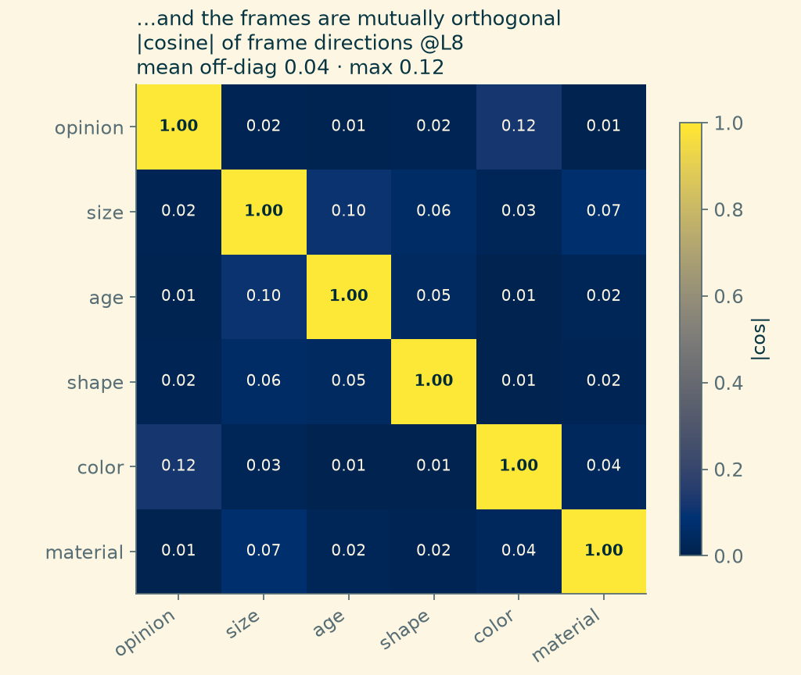
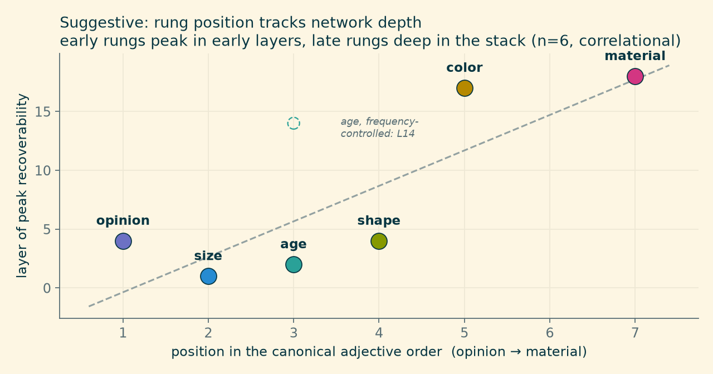

> Why would meaning stop at three?

[Last month](osgood-epa-language-model.html) we went looking for Charles Osgood's 1957 semantic differential inside a small language model, and found it: **Evaluation**, **Potency**, and **Activity**, recovered as three nearly-perpendicular directions in the hidden states of SmolLM2-1.7B, kept separate just as Osgood's factor analysis insisted.

That post ended with a tidy result and an untidy question. Osgood's three factors came from *human* raters filling out *affective* scales — good–bad, strong–weak, active–passive. The three-ness of meaning might be a fact about meaning. Or it might be a fact about which scales Osgood printed on his forms.

::: {.column-margin}
**What a "frame" is here.** A direction in the model's activation space, fit by ridge regression from a few labeled words, that turns any word into a signed number: project the word's hidden state onto the direction, read off the scalar. No fine-tuning, no prompting — a linear read of what's already there.
:::

A language model gives you a way to ask the question Osgood couldn't: the model doesn't care which scales you print. So we pointed the same measurement trick — fit a bipolar axis from a handful of labeled words, project everything else onto it — past affect, at everything else we could think of: size, age, shape, color, material, geographic remoteness, numbers, durations.

Meaning, it turns out, has a lot more than three numbers. But not *arbitrarily* more — and that's where it gets interesting.

## A panel, not a trio

Take a category like **size**, assign a few adjectives an ordinal scalar (*tiny* = −3 … *gigantic* = +3), embed each one in the same bland template ("It is a {word} object."), and ask a ridge regression to predict the scalar from the hidden state — scoring only on held-out words it never saw. If the model keeps a size *dimension*, the regression finds it. If it doesn't, cross-validation punishes you.

It keeps one. It keeps a panel of them:

{fig-alt="Bar chart of held-out cross-validation r for seven adjective-ordering rungs: opinion 0.99, size 0.98, age 0.91, shape 0.93, color 0.28 with a note that it recovers as a hue ring at R=0.72, space greyed at 0.16 after frequency control with its raw 0.89 shown as a ghost outline, material 0.80, with peak layers annotated on each bar."}

Beyond the adjectives, the same recipe recovers **number** (log-scaled numeric magnitude, r ≈ 0.95 — the strongest frame we've measured) and **duration** (log-seconds, r ≈ 0.91), each peaking in the earliest layers.

Recoverable-one-at-a-time could still mean tangled-together. The sharper claim is about the *angles between* the frames — Osgood's independence claim, generalized. Fit every frame's direction in one shared, standardized activation space and take pairwise cosines:

{fig-alt="Seven-by-seven heatmap of absolute cosine similarity between frame directions, with a bright diagonal of 1.0 and off-diagonal values from 0.00 to 0.12; the mean off-diagonal is 0.04."}

Mean off-diagonal |cos| = 0.04, max 0.12. The dials are orthogonal — a word's *size* reading tells you nothing about its *age* reading, its *opinion* reading nothing about its *material* reading. The frames compose into one joint coordinate system: measure a word once, get a vector of independent semantic coordinates.

And the largest off-diagonal cells are not noise; they're the most interesting numbers in the matrix. We'll come back to both.

## Magnitude is not one thing

There's a respectable hypothesis in cognitive science — **A Theory Of Magnitude** (ATOM) — that the brain runs number, physical size, and duration through one generalized magnitude system. "Big number," "big object," and "long time" would all be the same *big*, underneath.

The model votes no. Abstract number, physical size, and duration each recover as their own axis (0.95 / 0.73 / 0.91 — this size frame is log-*metres* over object nouns, a different instrument from the adjective rung above) — and the pairwise cosines between them are 0.01–0.08. All under 0.09. Three separate dials, no shared magnitude axis. The refutation replicates in Qwen2.5-1.5B and Phi-4-mini, so it's not a SmolLM2 quirk.

::: {.column-margin}
Scope, honestly: this is a *shared-linear-axis* null for these lexical items in these models — a fact about what next-token training builds, not a finding about human cognition. Though it does make you wonder.
:::

The hedge worth keeping: the magnitude trio's cosines (0.03–0.08) run slightly above the truly-unrelated pairs (~0.00–0.02) — a whisper of shared *extent*, but a whisper under 0.09 is still a refutation of "one system." The same whisper is the first of those large matrix cells: among the adjective rungs, the least-orthogonal pair is size·age at 0.10, the two rungs with an "extent" flavor. Extent leaks a little across dials everywhere it appears; it just never amounts to a shared axis.

## The panel has a membership list

Here's the part that made us sit up. The frames that recover well aren't a random grab-bag. They're the rungs of the **English adjective-ordering hierarchy**:

> opinion > size > age > shape > color > origin > material

— the linguistic universal that makes "a lovely big old round grey French wooden box" sound unremarkable and any other order sound faintly wrong. Native speakers apply it flawlessly and can't state it. It shows up, with variations, across many languages.

Five rungs of that hierarchy are recoverable, mutually-orthogonal scalar frames in the model (r 0.80–0.99); the remaining two — space and color — fail as scalars for two *different* and instructive reasons we take up below. The instrument panel isn't an arbitrary collection we happened to try — it's (largely) the same set of dimensions a known grammatical universal sorts adjectives by. Osgood's Evaluation, for what it's worth, is the *opinion* rung — the one grammar puts first, and the one his affective scales were built to catch.

## Rung order looks like layer order

One more pattern, flagged at exactly the confidence it deserves. Each frame peaks at some layer — and the early rungs of the hierarchy (opinion, size, age, shape) peak in the *earliest* layers (L1–4), while the late rungs (color, origin, material) peak *deep* in the stack (L17–18):

{fig-alt="Scatter plot of adjective-ordering position against the layer of peak recoverability, showing opinion, size, age and shape clustered at layers 1 through 4 and color and material at layers 17 and 18, with a dashed upward trend line and a note that age's frequency-controlled peak moves to layer 14."}

The adjective-ordering sequence tracks the depth at which the model computes each property. It's six points and it's correlational — material might peak late because it's more relational, not because of ordering per se, and age's frequency-controlled peak moves to L14 (see below), softening the early cluster — so this is a suggestion, not a result. But it's a lovely suggestion: the order grammar wants adjectives spoken in mirrors the order the network builds them in.

## The dials that don't work

Four negatives, because a panel with no broken gauges is a panel nobody tested — and two of these four broke in ways that taught us more than the working dials did.

**Space was frequency in a trench coat.** The space rung (*local* → *national* → *remote* → *cosmic*) recovered at a healthy-looking 0.89 — until we ran the control every frame claim needs: fit a **log-frequency direction** in the same space and check the books. Frequency itself is strongly encoded (r = 0.92, at layer 0 — purely lexical, right where a surface property belongs), and most rungs are orthogonal to it. But space's labels correlate −0.69 with word frequency — *local* and *national* are common words, *remote*, *exotic* and *cosmic* are rare ones. Regress frequency out of the labels and refit: **0.89 → 0.16. Nothing left.** The probe was reading rarity, not remoteness. (The same residualization leaves opinion untouched at 0.99, so the test isn't destroying real signal; age survives at 0.83 but its peak moves to L14.) One gauge, removed from the panel.

**Color's failure was a *shape* mismatch — hue is a ring.** As a lightness scalar, color manages r = 0.28, the panel's worst reading. But press a differently-shaped probe against it: predict cos θ and sin θ of each color's **hue angle** and reconstruct the angle, and hue recovers at **R = 0.72** (median error ~28°) where a naive linear fit on the same angle gets 0.47 — the wraparound penalty that only a genuinely *circular* representation produces. The a\*/b\* chroma channels recover at 0.60–0.65. So color isn't weakly represented; it's represented as a **ring plus a plane**, and a one-dimensional dial probe pressed against a wheel reads near-zero. Two grace notes: the circularity *emerges* mid-stack (at layer 0 the circular and linear fits tie — the ring is computed, not lexical), and in this *same model* calendar time is a **line**, not a ring — while Engels et al. found circular calendar features in Mistral. Linear-versus-circular is a per-concept, per-model fact, not a property of the domain. And the second large matrix cell — opinion·color at 0.12 — is the *blue = sad, rosy = optimistic* family of idioms leaking affect into color terms: idiom, not perceptual geometry, from a system that has never seen anything.

**"Material" was the wrong scalar.** Our first material frame (a hardness gradient: *fluffy* → *metallic*) recovered at only 0.73–0.80. Auditing it showed the model encodes material primarily as **naturalness** — natural ↔ synthetic — which recovers at 0.93 and is the most orthogonal frame in the family. The dial existed; we'd labeled it wrong. Measurement instruments fail in informative ways.

**Purpose isn't a dial at all.** The hierarchy's last rung (*cooking*, *racing*, *sleeping* — purpose adjectives) resists every scalar we tried. It behaves categorically, not ordinally. Some meaning is coordinates; some is discrete structure; a good instrument panel knows which gauges it doesn't have.

::: {.column-margin}
**A measurement bug worth stealing.** Foreign words tokenize into several subwords, and the meaning assembles at the *last* one. Reading the first subword — a natural default — understated every cross-lingual number we had: affect transfer jumped from 0.47 to 0.91, color from 0.34 to 0.72, when we switched to last-subword readout. If you probe multilingual text, read the last subword.
:::

And one methodological footnote that changed our numbers twice: cross-lingual frames live **mid-stack**. Within English, lexical frames peak early; but the version of a frame that transfers across languages (an English-fit axis correctly poling Spanish, French, German words) peaks around layers 11–16 — the model's shared concept space, past the surface of any one language. The early peaks are English lexicon; the middle of the network is where *meaning*, in the transferable sense, lives.

## What an instrument panel is for

None of this stays decorative. Two working examples from the same project:

**Adjective ordering itself.** Given the frames, you can classify any adjective to its rung by geometry alone and sort by the canonical order — which took our solver for the BBH *hyperbaton* task (choose the correctly-ordered adjective string) from 85% to **95%**, replacing a coarser one-axis heuristic. The model's own geometry knows why "big old red barn" sounds right.

**Questions with no column to sort by.** "Which is biggest: an ant, a whale, a mouse?" has no table behind it — but the size frame *synthesizes* the missing column: project each option, rank, answer. That's a capability a symbolic system can't fake (there's nothing to `ORDER BY`) and a plain language model answers unreliably; a measured dial does it deterministically.

The whole panel — eight frames, fit words, directions, calibration metadata — serializes to a **174 KB file** that ships with the library and loads automatically. Meaning-as-coordinates is not a metaphor here; it's a small binary artifact.

## Three numbers were the corner of the panel

Osgood was right about more than he could measure. Meaning *does* compress onto a small set of independent bipolar dimensions — he found the three his affective scales could see, and they're real, orthogonal, and cross-lingual in the model too. But the panel is bigger: the grammar's own adjective hierarchy, plus number and time, each its own orthogonal dial, jointly a compact coordinate system for what words mean — sitting inside a 1.7B-parameter model that was only ever asked to guess the next token.

What's still open: a real treatment of *purpose* (categorical, not scalar), the frequency audit applied to the rest of the family (number's small-numbers-are-common labels deserve the same suspicion space failed), whether the hue ring is circular in *other* models (Engels et al. suggest the answer varies), whether the depth-order correlation survives more careful controls, and the same panel fit on other model families. The dials also turn out to *turn* — steering along a frame direction causally shifts what the model generates — but measurement and control deserve separate posts, and this one was about reading the gauges.

---

*Experiments and code: [turnstyle](https://github.com/jdonaldson/turnstyle) (`experiments/ordering_frames.py`, `frame_family_matrix.py`, `time_frame.py`, `size_frame.py`, `material_investigate.py`, `atom_crossmodel.py`, and the audits `freq_control.py`, `freq_residual.py`, `color_ring.py`; the shipped panel is `src/turnstyle/frame_library.py`). Figures from fresh runs, 2026-07-05 (`experiments/results/*.json`). Model: SmolLM2-1.7B-Instruct; ATOM replication also on Qwen2.5-1.5B-Instruct and Phi-4-mini-instruct.*
