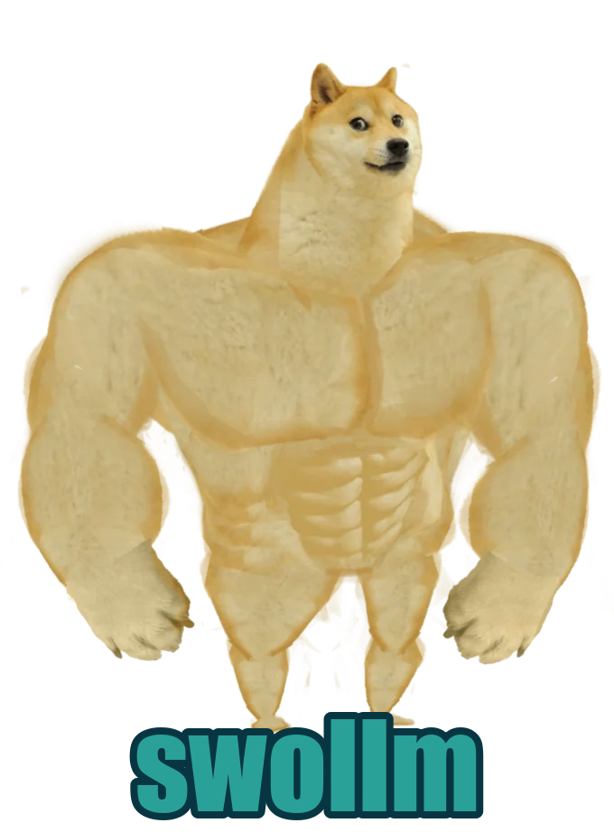
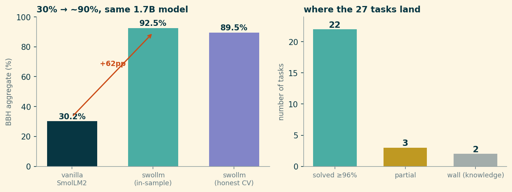

::: {.column-margin}
{fig-alt="A muscular cartoon Shiba Inu (the Swole Doge meme) with the word swollm beneath it."}
:::

> A small model doesn't usually fail because it can't compute the answer. It fails because it won't stop guessing long enough to compute it.

[BIG-Bench Hard](https://github.com/suzgunmirac/BIG-Bench-Hard) (BBH) is a curated set of tasks where, at the time it was assembled, language models did *worse* than the average human rater: multi-step arithmetic, tracking shuffled objects, Dyck-language bracket closing, date arithmetic, logical deduction over ordered constraints. It was designed to be a wall for models that lean on pattern-matching instead of procedure.

So a small model should faceplant on it, and **SmolLM2-1.7B** — a genuinely tiny open model by 2026 standards — does. Three-shot prompted, it averages **30.2%** across the 27-task suite. On `multistep_arithmetic_two` it scores **0.4%**. It is not close.

Here is the same model, unchanged, wrapped in a neurosymbolic layer I call **Turnstyle** (the wrapped model, affectionately, is "swollm"):

{fig-alt="A horizontal bar chart of 27 BIG-Bench Hard tasks sorted by accuracy. Most tasks reach 100 percent, shown as a dark base segment for the bare model plus a colored segment for the neurosymbolic gain. Teal segments mark symbolic solvers, purple segments mark hidden-state probes. Two tasks at the bottom — causal judgement and sports understanding — show only the dark bare-model bar with no gain; movie recommendation and salient translation show a purple recognition gain over their faint baselines."}

The aggregate goes from **30.2% to 92.5%** in-sample — and to a hard-nosed **~89.5%** once every probe is cross-validated and forced to be order-robust (more on both below). Either way it is a roughly **+60-point** swing on the identical 1.7B weights. Eighteen of the twenty-seven tasks land at exactly 100%; twenty-two clear 96%. Nobody fine-tuned anything. The trick is entirely in *how the model is asked, and what happens to its answer before it commits to one.*

::: {.callout-tip}
**Try it yourself.** The bare model and the wrapped model run side by side — each answer with its worked proof — in the [live Turnstyle demo on Hugging Face](https://huggingface.co/spaces/jdonaldson/turnstyle-demo).
:::

## Three ways to answer

The wrapper's whole architecture fits in one sentence: **parse the prompt into a typed task, then either prove the answer, recognize it, or admit you can't.**

**Prove it (teal).** A lot of BBH is secretly deterministic. `multistep_arithmetic_two` is a parenthesized integer expression — you don't need a 1.7B transformer to "reason" about `((6 * -6 * 8) * (-1 * 7 * -6 + -2))`, you need an AST and Python. `dyck_languages` is a bracket stack. `tracking_shuffled_objects` is replaying a list of swaps. `web_of_lies` is propagating truth values down a chain. For these, Turnstyle parses the prompt into a structured form, runs an exact solver, and then **biases the model's generation toward the proven answer** with a logit constraint — so the *model* still produces the text, but it can no longer wander off the correct token. These are the bars that hit 100%, and they hit it because a proof is a proof.

**Recognize it (purple).** Some tasks aren't computable from the prompt — they need a judgment the model actually holds but won't *say*. `snarks` (which of two sentences is sarcastic) is the cleanest example: three-shot, SmolLM2 scores **46% — below chance for a binary task.** It has strong, confident, *wrong* opinions. But the judgment is in there: train a small linear probe on the model's hidden state at the right layer and read the answer directly off the activation, and it goes to **100% in-sample / 74% cross-validated.** Same for pronoun disambiguation, temporal ordering, humorous-name edits. The model knows; generation was the bottleneck.

**Admit the wall (grey).** Two tasks don't move at all: `causal_judgement` and `sports_understanding`. These are knowledge-loaded — they turn on facts and judgments a 1.7B model trained on a modest corpus may simply not have, and a probe on its hidden state does no better than guessing the majority class. The honest move is to *detect that there's no signal to extract* and fall back to the bare model rather than fabricate a solver that overfits 250 examples. The two grey bars are a feature: they're where the system correctly declines to pretend.

That triad — **⊢ proved, ⊨ recognized, or abstain** — is the entire idea. The name "Turnstyle" is a pun on the logical turnstile: `⊢` for *syntactically derivable* (the symbolic solvers) and `⊨` for *semantically entailed* (the probes recognize what the model already represents).

## The honest accounting

Here's where I have to slow down, because the headline number is doing two slightly different things at once.

{fig-alt="Two panels. Left: a bar chart showing vanilla SmolLM2 at 30.2 percent, swollm in-sample at 92.5 percent, and swollm honest cross-validated at 89.5 percent, with an arrow marking a roughly 60 point gain. Right: a bar chart of task outcomes — 22 solved at or above 96 percent, 3 partial, 2 walls."}

The symbolic tasks (teal) are honest at 100% — a proof generalizes, there's no in-sample/out-of-sample distinction for arithmetic. But the **probe** tasks (purple) are fit on the BBH examples themselves, and a probe that scores 100% *in-sample* will score lower on held-out data. When you replace each probe's in-sample number with its 5-fold cross-validated number, the aggregate settles at about **89.5%**, not 92.5%. That ~3-point gap is the part of the headline that's borrowed against future data, and I'd rather show you the gap than launder it.

A second honesty knob: the probes have to be **order-robust.** A multiple-choice probe that reads "which option is the answer" can secretly learn "the answer is usually B." We test this by permuting the options and re-scoring; an honest probe's accuracy shouldn't move. Early versions moved by 15 points. The shipped ones score the options in a position-marginalized way (average over cyclic shifts) so the number you see survives reordering — at the cost of a couple points of raw accuracy. The robust number is the real one.

## The walls weren't all walls

Look at the two tasks sitting just above the walls — `movie_recommendation` and `salient_translation`. They almost ended up grey.

Three-shot, the model *generates* the right movie about 22% of the time, so for a long while I had both filed under "no representation to extract" — apparent walls. That turned out to be wrong, and wrong in a way that matters. When I trained a recognition probe on them the way I had for snarks, the signal was *there*: the movie probe recognizes the right answer at ~50% in-sample and **~80% on held-out data**, against that 22% generation. The model could **recognize** the correct movie far better than it could **generate** it — the wall was the same generation bottleneck snarks had, hidden behind a multiple-choice format I hadn't probed correctly. (`salient_translation` recovered the same way, 14% → ~42%.)

`causal_judgement` and `sports_understanding`, by contrast, stayed grey — their probes score no better than the majority class, which is exactly what a genuine knowledge gap looks like. So what first looked like four walls is really **two walls and two illusions** — and those two recovered tasks are why the honest aggregate lands near **89.5%** rather than the mid-80s.

The general law underneath: **recognition ≫ generation.** A small model's *answer* is a lossy readout of a richer internal state. If you can find the state and read it directly — with a probe, or by routing the question to a solver — you can recover capability the model has but cannot articulate. "Stop guessing" is not a metaphor; it's the mechanism.

## Where a 1.7B model lands

It's worth seeing the placement, with the asterisk attached — against [Epoch AI's BBH leaderboard](https://epoch.ai/data/ai-benchmarking-dashboard) of general models, run with standardized 3-shot chain-of-thought. Plot parameter count against score and swollm doesn't sit on the curve at all:

{fig-alt="Scatter plot of model parameters on a log x-axis versus BBH accuracy. A cyan star marks swollm at 1.7 billion parameters and 89.5 percent, far above a dashed trend line through the general models that rises from small models near 30 percent to DeepSeek-V3 and Llama-3.1-405B near 85 percent. An orange dashed arrow shows swollm rising 59 points above the bare SmolLM2-1.7B at the same horizontal position."}

A 1.7B model sitting above DeepSeek-V3 and Llama-3.1-405B — and **59 points** above the *bare* SmolLM2 of identical size. As a flat ranking it tells the same story:

{fig-alt="A horizontal bar chart placing swollm on the Epoch AI BBH leaderboard. swollm is highlighted in cyan at 89.5 percent, at the top, a dead heat with Gemini 1.5 Pro at 89.2 and above DeepSeek-V3 at 87.5. Three orange bars at the bottom — Gemma 2B at 35.2, bare SmolLM2-1.7B at 30.2, and Qwen-1.8B at 28.2 — mark the same roughly-2B weight class. A red note warns the comparison is not apples-to-apples."}

The honest reading isn't "a 1.7B model ties Gemini." It's the **orange bars**: every other model in SmolLM2's weight class — Qwen-1.8B, Gemma 2B, and bare SmolLM2 itself — lives at 28–35%, exactly where you'd expect a tiny model on a benchmark built to break tiny models. The neurosymbolic layer is the entire difference between the bottom of that chart and the top of it, on identical-size weights. What the comparison measures is not raw intelligence; it's *how much of a small model's latent capability is being thrown away by letting it guess.*

## What this is and isn't

This is **not** a claim that a 1.7B model beats GPT-scale models on reasoning. The giants run chain-of-thought and answer in free text on tasks Turnstyle hasn't parsed; the comparison isn't apples-to-apples and I'm not going to pretend it is. BBH here is a **test harness, not the objective** — it provides ground-truth labels and structural variety to validate tools that are supposed to work *beyond* BBH. The arithmetic solver, the bracket solver, the polarity probe, the date solver: each is built to generalize past the 250 examples it was checked on, and several are deliberately stripped of their BBH-specific scaffolding and re-tested on the bare capability.

What it **is**: evidence that a large fraction of "small models can't reason" is actually "small models can't *commit*." The capability is frequently present — as a computable structure in the prompt, or as a recognizable pattern in the activations — and a thin, cheap, training-free layer that parses, proves, recognizes, or honestly abstains can surface most of it. No new parameters. No fine-tuning. Just refusing to let a 1.7B model guess when it could instead know.

You can poke at it yourself — the bare model and the wrapped model, side by side, with the worked proof for each answer — on the [live demo](https://huggingface.co/spaces/jdonaldson/turnstyle-demo). Try the arithmetic expression first. Watch the left pane confidently produce a wrong number, and the right pane prove the right one.

---

*Code & data: [github.com/jdonaldson/turnstyle](https://github.com/jdonaldson/turnstyle). The baseline and symbolic per-task numbers come from the swollm 3-shot evaluation (`results/v13/bbh_full.json`); the `movie`/`salient` recognition probes and the ~89.5% honest aggregate are from turnstyle's native dispatch. Figures regenerate from `experiments/blog_bbh_figs.py`.*
